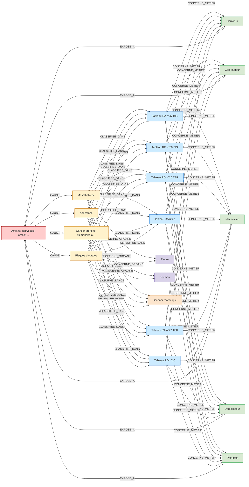

```mermaid
graph LR
    Substance_amiante["Amiante (chrysotile, amosit…"]
    Pathologie_mesotheliome["Mesotheliome"]
    Pathologie_asbestose["Asbestose"]
    Pathologie_cancer_broncho_pulmonaire_amiante["Cancer broncho pulmonaire a…"]
    Pathologie_plaques_pleurales["Plaques pleurales"]
    Tableau_MP_RA_47_BIS["Tableau RA n°47 BIS"]
    Tableau_MP_RG_30_BIS["Tableau RG n°30 BIS"]
    Tableau_MP_RG_30_TER["Tableau RG n°30 TER"]
    Tableau_MP_RA_47["Tableau RA n°47"]
    Tableau_MP_RA_47_TER["Tableau RA n°47 TER"]
    Tableau_MP_RG_30["Tableau RG n°30"]
    Metier_calorifugeur["Calorifugeur"]
    Metier_couvreur["Couvreur"]
    Metier_demolisseur["Demolisseur"]
    Metier_mecanicien["Mecanicien"]
    Metier_plombier["Plombier"]
    Organe_plevre["Plèvre"]
    Organe_poumon["Poumon"]
    Examen_scanner_thoracique["Scanner thoracique"]
    Substance_amiante -->|CAUSE| Pathologie_mesotheliome
    Substance_amiante -->|CAUSE| Pathologie_asbestose
    Substance_amiante -->|CAUSE| Pathologie_cancer_broncho_pulmonaire_amiante
    Substance_amiante -->|CAUSE| Pathologie_plaques_pleurales
    Pathologie_mesotheliome -->|CLASSIFIEE_DANS| Tableau_MP_RG_30
    Pathologie_mesotheliome -->|CLASSIFIEE_DANS| Tableau_MP_RG_30_BIS
    Pathologie_mesotheliome -->|CLASSIFIEE_DANS| Tableau_MP_RG_30_TER
    Pathologie_mesotheliome -->|CLASSIFIEE_DANS| Tableau_MP_RA_47
    Pathologie_mesotheliome -->|CLASSIFIEE_DANS| Tableau_MP_RA_47_BIS
    Pathologie_mesotheliome -->|CLASSIFIEE_DANS| Tableau_MP_RA_47_TER
    Pathologie_mesotheliome -->|CONCERNE_ORGANE| Organe_plevre
    Pathologie_mesotheliome -->|SURVEILLANCE| Examen_scanner_thoracique
    Pathologie_asbestose -->|CLASSIFIEE_DANS| Tableau_MP_RG_30
    Pathologie_asbestose -->|CLASSIFIEE_DANS| Tableau_MP_RG_30_BIS
    Pathologie_asbestose -->|CLASSIFIEE_DANS| Tableau_MP_RG_30_TER
    Pathologie_asbestose -->|CLASSIFIEE_DANS| Tableau_MP_RA_47
    Pathologie_asbestose -->|CLASSIFIEE_DANS| Tableau_MP_RA_47_BIS
    Pathologie_asbestose -->|CLASSIFIEE_DANS| Tableau_MP_RA_47_TER
    Pathologie_asbestose -->|CONCERNE_ORGANE| Organe_poumon
    Pathologie_asbestose -->|SURVEILLANCE| Examen_scanner_thoracique
    Pathologie_cancer_broncho_pulmonaire_amiante -->|CLASSIFIEE_DANS| Tableau_MP_RG_30
    Pathologie_cancer_broncho_pulmonaire_amiante -->|CLASSIFIEE_DANS| Tableau_MP_RG_30_BIS
    Pathologie_cancer_broncho_pulmonaire_amiante -->|CLASSIFIEE_DANS| Tableau_MP_RG_30_TER
    Pathologie_cancer_broncho_pulmonaire_amiante -->|CLASSIFIEE_DANS| Tableau_MP_RA_47
    Pathologie_cancer_broncho_pulmonaire_amiante -->|CLASSIFIEE_DANS| Tableau_MP_RA_47_BIS
    Pathologie_cancer_broncho_pulmonaire_amiante -->|CLASSIFIEE_DANS| Tableau_MP_RA_47_TER
    Pathologie_cancer_broncho_pulmonaire_amiante -->|CONCERNE_ORGANE| Organe_poumon
    Pathologie_cancer_broncho_pulmonaire_amiante -->|SURVEILLANCE| Examen_scanner_thoracique
    Pathologie_plaques_pleurales -->|CLASSIFIEE_DANS| Tableau_MP_RG_30
    Pathologie_plaques_pleurales -->|CLASSIFIEE_DANS| Tableau_MP_RG_30_BIS
    Pathologie_plaques_pleurales -->|CLASSIFIEE_DANS| Tableau_MP_RG_30_TER
    Pathologie_plaques_pleurales -->|CLASSIFIEE_DANS| Tableau_MP_RA_47
    Pathologie_plaques_pleurales -->|CLASSIFIEE_DANS| Tableau_MP_RA_47_BIS
    Pathologie_plaques_pleurales -->|CLASSIFIEE_DANS| Tableau_MP_RA_47_TER
    Pathologie_plaques_pleurales -->|CONCERNE_ORGANE| Organe_plevre
    Pathologie_plaques_pleurales -->|SURVEILLANCE| Examen_scanner_thoracique
    Tableau_MP_RA_47_BIS -->|CONCERNE_METIER| Metier_couvreur
    Tableau_MP_RA_47_BIS -->|CONCERNE_METIER| Metier_calorifugeur
    Tableau_MP_RA_47_BIS -->|CONCERNE_METIER| Metier_mecanicien
    Tableau_MP_RA_47_BIS -->|CONCERNE_METIER| Metier_demolisseur
    Tableau_MP_RA_47_BIS -->|CONCERNE_METIER| Metier_plombier
    Tableau_MP_RG_30_BIS -->|CONCERNE_METIER| Metier_couvreur
    Tableau_MP_RG_30_BIS -->|CONCERNE_METIER| Metier_calorifugeur
    Tableau_MP_RG_30_BIS -->|CONCERNE_METIER| Metier_mecanicien
    Tableau_MP_RG_30_BIS -->|CONCERNE_METIER| Metier_demolisseur
    Tableau_MP_RG_30_BIS -->|CONCERNE_METIER| Metier_plombier
    Tableau_MP_RG_30_TER -->|CONCERNE_METIER| Metier_couvreur
    Tableau_MP_RG_30_TER -->|CONCERNE_METIER| Metier_calorifugeur
    Tableau_MP_RG_30_TER -->|CONCERNE_METIER| Metier_mecanicien
    Tableau_MP_RG_30_TER -->|CONCERNE_METIER| Metier_demolisseur
    Tableau_MP_RG_30_TER -->|CONCERNE_METIER| Metier_plombier
    Tableau_MP_RA_47 -->|CONCERNE_METIER| Metier_couvreur
    Tableau_MP_RA_47 -->|CONCERNE_METIER| Metier_calorifugeur
    Tableau_MP_RA_47 -->|CONCERNE_METIER| Metier_mecanicien
    Tableau_MP_RA_47 -->|CONCERNE_METIER| Metier_demolisseur
    Tableau_MP_RA_47 -->|CONCERNE_METIER| Metier_plombier
    Tableau_MP_RA_47_TER -->|CONCERNE_METIER| Metier_couvreur
    Tableau_MP_RA_47_TER -->|CONCERNE_METIER| Metier_calorifugeur
    Tableau_MP_RA_47_TER -->|CONCERNE_METIER| Metier_mecanicien
    Tableau_MP_RA_47_TER -->|CONCERNE_METIER| Metier_demolisseur
    Tableau_MP_RA_47_TER -->|CONCERNE_METIER| Metier_plombier
    Tableau_MP_RG_30 -->|CONCERNE_METIER| Metier_couvreur
    Tableau_MP_RG_30 -->|CONCERNE_METIER| Metier_calorifugeur
    Tableau_MP_RG_30 -->|CONCERNE_METIER| Metier_mecanicien
    Tableau_MP_RG_30 -->|CONCERNE_METIER| Metier_demolisseur
    Tableau_MP_RG_30 -->|CONCERNE_METIER| Metier_plombier
    Metier_calorifugeur -->|EXPOSE_A| Substance_amiante
    Metier_couvreur -->|EXPOSE_A| Substance_amiante
    Metier_demolisseur -->|EXPOSE_A| Substance_amiante
    Metier_mecanicien -->|EXPOSE_A| Substance_amiante
    Metier_plombier -->|EXPOSE_A| Substance_amiante

    classDef substance fill:#ffcccc,stroke:#990000
    classDef pathologie fill:#fff2cc,stroke:#cc7700
    classDef tableau_mp fill:#ccebff,stroke:#0066cc
    classDef metier fill:#d9ead3,stroke:#34a853
    classDef organe fill:#d9d2e9,stroke:#674ea7
    classDef examen fill:#fce5cd,stroke:#e69138
    class Substance_amiante substance
    class Pathologie_mesotheliome pathologie
    class Pathologie_asbestose pathologie
    class Pathologie_cancer_broncho_pulmonaire_amiante pathologie
    class Pathologie_plaques_pleurales pathologie
    class Tableau_MP_RA_47_BIS tableau_mp
    class Tableau_MP_RG_30_BIS tableau_mp
    class Tableau_MP_RG_30_TER tableau_mp
    class Tableau_MP_RA_47 tableau_mp
    class Tableau_MP_RA_47_TER tableau_mp
    class Tableau_MP_RG_30 tableau_mp
    class Metier_calorifugeur metier
    class Metier_couvreur metier
    class Metier_demolisseur metier
    class Metier_mecanicien metier
    class Metier_plombier metier
    class Organe_plevre organe
    class Organe_poumon organe
    class Examen_scanner_thoracique examen
```