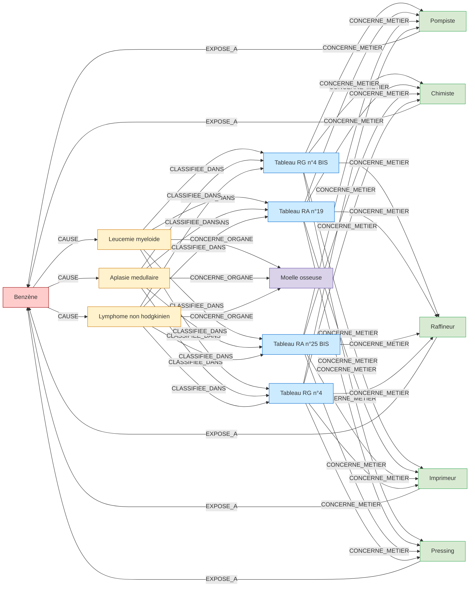

```mermaid
graph LR
    Substance_benzene["Benzène"]
    Pathologie_leucemie_myeloide["Leucemie myeloide"]
    Pathologie_aplasie_medullaire["Aplasie medullaire"]
    Pathologie_lymphome_non_hodgkinien["Lymphome non hodgkinien"]
    Tableau_MP_RG_4_BIS["Tableau RG n°4 BIS"]
    Tableau_MP_RA_19["Tableau RA n°19"]
    Tableau_MP_RA_25_BIS["Tableau RA n°25 BIS"]
    Tableau_MP_RG_4["Tableau RG n°4"]
    Metier_chimiste["Chimiste"]
    Metier_imprimeur["Imprimeur"]
    Metier_pompiste["Pompiste"]
    Metier_pressing["Pressing"]
    Metier_raffineur["Raffineur"]
    Organe_moelle_osseuse["Moelle osseuse"]
    Substance_benzene -->|CAUSE| Pathologie_leucemie_myeloide
    Substance_benzene -->|CAUSE| Pathologie_aplasie_medullaire
    Substance_benzene -->|CAUSE| Pathologie_lymphome_non_hodgkinien
    Pathologie_leucemie_myeloide -->|CLASSIFIEE_DANS| Tableau_MP_RG_4
    Pathologie_leucemie_myeloide -->|CLASSIFIEE_DANS| Tableau_MP_RG_4_BIS
    Pathologie_leucemie_myeloide -->|CLASSIFIEE_DANS| Tableau_MP_RA_19
    Pathologie_leucemie_myeloide -->|CLASSIFIEE_DANS| Tableau_MP_RA_25_BIS
    Pathologie_leucemie_myeloide -->|CONCERNE_ORGANE| Organe_moelle_osseuse
    Pathologie_aplasie_medullaire -->|CLASSIFIEE_DANS| Tableau_MP_RG_4
    Pathologie_aplasie_medullaire -->|CLASSIFIEE_DANS| Tableau_MP_RG_4_BIS
    Pathologie_aplasie_medullaire -->|CLASSIFIEE_DANS| Tableau_MP_RA_19
    Pathologie_aplasie_medullaire -->|CLASSIFIEE_DANS| Tableau_MP_RA_25_BIS
    Pathologie_aplasie_medullaire -->|CONCERNE_ORGANE| Organe_moelle_osseuse
    Pathologie_lymphome_non_hodgkinien -->|CLASSIFIEE_DANS| Tableau_MP_RG_4
    Pathologie_lymphome_non_hodgkinien -->|CLASSIFIEE_DANS| Tableau_MP_RG_4_BIS
    Pathologie_lymphome_non_hodgkinien -->|CLASSIFIEE_DANS| Tableau_MP_RA_19
    Pathologie_lymphome_non_hodgkinien -->|CLASSIFIEE_DANS| Tableau_MP_RA_25_BIS
    Pathologie_lymphome_non_hodgkinien -->|CONCERNE_ORGANE| Organe_moelle_osseuse
    Tableau_MP_RG_4_BIS -->|CONCERNE_METIER| Metier_pompiste
    Tableau_MP_RG_4_BIS -->|CONCERNE_METIER| Metier_chimiste
    Tableau_MP_RG_4_BIS -->|CONCERNE_METIER| Metier_raffineur
    Tableau_MP_RG_4_BIS -->|CONCERNE_METIER| Metier_imprimeur
    Tableau_MP_RG_4_BIS -->|CONCERNE_METIER| Metier_pressing
    Tableau_MP_RA_19 -->|CONCERNE_METIER| Metier_pompiste
    Tableau_MP_RA_19 -->|CONCERNE_METIER| Metier_chimiste
    Tableau_MP_RA_19 -->|CONCERNE_METIER| Metier_raffineur
    Tableau_MP_RA_19 -->|CONCERNE_METIER| Metier_imprimeur
    Tableau_MP_RA_19 -->|CONCERNE_METIER| Metier_pressing
    Tableau_MP_RA_25_BIS -->|CONCERNE_METIER| Metier_pompiste
    Tableau_MP_RA_25_BIS -->|CONCERNE_METIER| Metier_chimiste
    Tableau_MP_RA_25_BIS -->|CONCERNE_METIER| Metier_raffineur
    Tableau_MP_RA_25_BIS -->|CONCERNE_METIER| Metier_imprimeur
    Tableau_MP_RA_25_BIS -->|CONCERNE_METIER| Metier_pressing
    Tableau_MP_RG_4 -->|CONCERNE_METIER| Metier_pompiste
    Tableau_MP_RG_4 -->|CONCERNE_METIER| Metier_chimiste
    Tableau_MP_RG_4 -->|CONCERNE_METIER| Metier_raffineur
    Tableau_MP_RG_4 -->|CONCERNE_METIER| Metier_imprimeur
    Tableau_MP_RG_4 -->|CONCERNE_METIER| Metier_pressing
    Metier_chimiste -->|EXPOSE_A| Substance_benzene
    Metier_imprimeur -->|EXPOSE_A| Substance_benzene
    Metier_pompiste -->|EXPOSE_A| Substance_benzene
    Metier_pressing -->|EXPOSE_A| Substance_benzene
    Metier_raffineur -->|EXPOSE_A| Substance_benzene

    classDef substance fill:#ffcccc,stroke:#990000
    classDef pathologie fill:#fff2cc,stroke:#cc7700
    classDef tableau_mp fill:#ccebff,stroke:#0066cc
    classDef metier fill:#d9ead3,stroke:#34a853
    classDef organe fill:#d9d2e9,stroke:#674ea7
    classDef examen fill:#fce5cd,stroke:#e69138
    class Substance_benzene substance
    class Pathologie_leucemie_myeloide pathologie
    class Pathologie_aplasie_medullaire pathologie
    class Pathologie_lymphome_non_hodgkinien pathologie
    class Tableau_MP_RG_4_BIS tableau_mp
    class Tableau_MP_RA_19 tableau_mp
    class Tableau_MP_RA_25_BIS tableau_mp
    class Tableau_MP_RG_4 tableau_mp
    class Metier_chimiste metier
    class Metier_imprimeur metier
    class Metier_pompiste metier
    class Metier_pressing metier
    class Metier_raffineur metier
    class Organe_moelle_osseuse organe
```