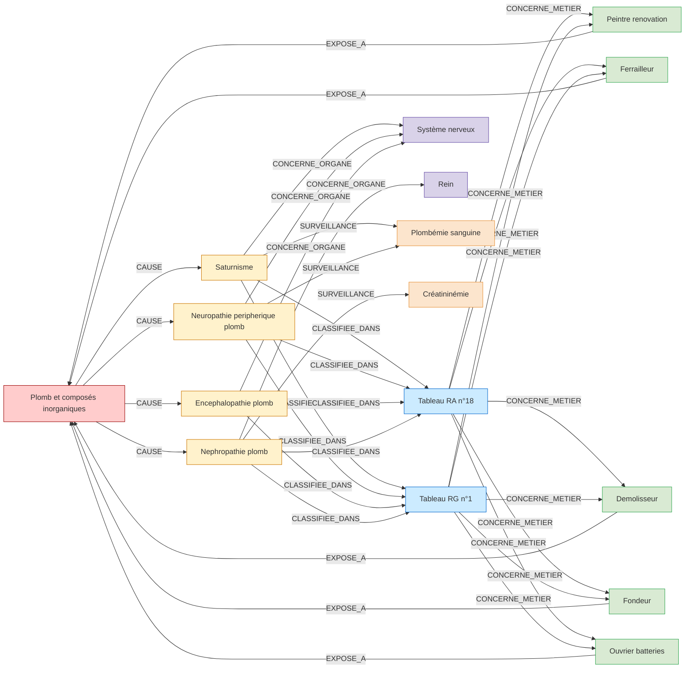

```mermaid
graph LR
    Substance_plomb["Plomb et composés inorganiques"]
    Pathologie_saturnisme["Saturnisme"]
    Pathologie_neuropathie_peripherique_plomb["Neuropathie peripherique plomb"]
    Pathologie_encephalopathie_plomb["Encephalopathie plomb"]
    Pathologie_nephropathie_plomb["Nephropathie plomb"]
    Tableau_MP_RA_18["Tableau RA n°18"]
    Tableau_MP_RG_1["Tableau RG n°1"]
    Metier_demolisseur["Demolisseur"]
    Metier_ferrailleur["Ferrailleur"]
    Metier_fondeur["Fondeur"]
    Metier_ouvrier_batteries["Ouvrier batteries"]
    Metier_peintre_renovation["Peintre renovation"]
    Organe_systeme_nerveux["Système nerveux"]
    Organe_rein["Rein"]
    Examen_plombemie["Plombémie sanguine"]
    Examen_creatinemie["Créatininémie"]
    Substance_plomb -->|CAUSE| Pathologie_saturnisme
    Substance_plomb -->|CAUSE| Pathologie_neuropathie_peripherique_plomb
    Substance_plomb -->|CAUSE| Pathologie_encephalopathie_plomb
    Substance_plomb -->|CAUSE| Pathologie_nephropathie_plomb
    Pathologie_saturnisme -->|CLASSIFIEE_DANS| Tableau_MP_RG_1
    Pathologie_saturnisme -->|CLASSIFIEE_DANS| Tableau_MP_RA_18
    Pathologie_saturnisme -->|CONCERNE_ORGANE| Organe_systeme_nerveux
    Pathologie_saturnisme -->|SURVEILLANCE| Examen_plombemie
    Pathologie_neuropathie_peripherique_plomb -->|CLASSIFIEE_DANS| Tableau_MP_RG_1
    Pathologie_neuropathie_peripherique_plomb -->|CLASSIFIEE_DANS| Tableau_MP_RA_18
    Pathologie_neuropathie_peripherique_plomb -->|CONCERNE_ORGANE| Organe_systeme_nerveux
    Pathologie_neuropathie_peripherique_plomb -->|SURVEILLANCE| Examen_plombemie
    Pathologie_encephalopathie_plomb -->|CLASSIFIEE_DANS| Tableau_MP_RG_1
    Pathologie_encephalopathie_plomb -->|CLASSIFIEE_DANS| Tableau_MP_RA_18
    Pathologie_encephalopathie_plomb -->|CONCERNE_ORGANE| Organe_systeme_nerveux
    Pathologie_nephropathie_plomb -->|CLASSIFIEE_DANS| Tableau_MP_RG_1
    Pathologie_nephropathie_plomb -->|CLASSIFIEE_DANS| Tableau_MP_RA_18
    Pathologie_nephropathie_plomb -->|CONCERNE_ORGANE| Organe_rein
    Pathologie_nephropathie_plomb -->|SURVEILLANCE| Examen_creatinemie
    Tableau_MP_RA_18 -->|CONCERNE_METIER| Metier_peintre_renovation
    Tableau_MP_RA_18 -->|CONCERNE_METIER| Metier_ferrailleur
    Tableau_MP_RA_18 -->|CONCERNE_METIER| Metier_demolisseur
    Tableau_MP_RA_18 -->|CONCERNE_METIER| Metier_fondeur
    Tableau_MP_RA_18 -->|CONCERNE_METIER| Metier_ouvrier_batteries
    Tableau_MP_RG_1 -->|CONCERNE_METIER| Metier_peintre_renovation
    Tableau_MP_RG_1 -->|CONCERNE_METIER| Metier_ferrailleur
    Tableau_MP_RG_1 -->|CONCERNE_METIER| Metier_demolisseur
    Tableau_MP_RG_1 -->|CONCERNE_METIER| Metier_fondeur
    Tableau_MP_RG_1 -->|CONCERNE_METIER| Metier_ouvrier_batteries
    Metier_demolisseur -->|EXPOSE_A| Substance_plomb
    Metier_ferrailleur -->|EXPOSE_A| Substance_plomb
    Metier_fondeur -->|EXPOSE_A| Substance_plomb
    Metier_ouvrier_batteries -->|EXPOSE_A| Substance_plomb
    Metier_peintre_renovation -->|EXPOSE_A| Substance_plomb

    classDef substance fill:#ffcccc,stroke:#990000
    classDef pathologie fill:#fff2cc,stroke:#cc7700
    classDef tableau_mp fill:#ccebff,stroke:#0066cc
    classDef metier fill:#d9ead3,stroke:#34a853
    classDef organe fill:#d9d2e9,stroke:#674ea7
    classDef examen fill:#fce5cd,stroke:#e69138
    class Substance_plomb substance
    class Pathologie_saturnisme pathologie
    class Pathologie_neuropathie_peripherique_plomb pathologie
    class Pathologie_encephalopathie_plomb pathologie
    class Pathologie_nephropathie_plomb pathologie
    class Tableau_MP_RA_18 tableau_mp
    class Tableau_MP_RG_1 tableau_mp
    class Metier_demolisseur metier
    class Metier_ferrailleur metier
    class Metier_fondeur metier
    class Metier_ouvrier_batteries metier
    class Metier_peintre_renovation metier
    class Organe_systeme_nerveux organe
    class Organe_rein organe
    class Examen_plombemie examen
    class Examen_creatinemie examen
```