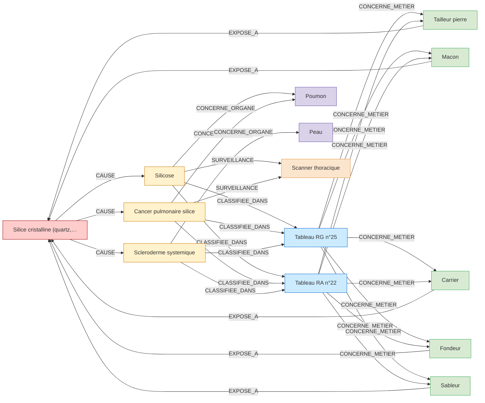

```mermaid
graph LR
    Substance_silice_cristalline["Silice cristalline (quartz,…"]
    Pathologie_silicose["Silicose"]
    Pathologie_cancer_pulmonaire_silice["Cancer pulmonaire silice"]
    Pathologie_scleroderme_systemique["Scleroderme systemique"]
    Tableau_MP_RG_25["Tableau RG n°25"]
    Tableau_MP_RA_22["Tableau RA n°22"]
    Metier_carrier["Carrier"]
    Metier_fondeur["Fondeur"]
    Metier_macon["Macon"]
    Metier_sableur["Sableur"]
    Metier_tailleur_pierre["Tailleur pierre"]
    Organe_poumon["Poumon"]
    Organe_peau["Peau"]
    Examen_scanner_thoracique["Scanner thoracique"]
    Substance_silice_cristalline -->|CAUSE| Pathologie_silicose
    Substance_silice_cristalline -->|CAUSE| Pathologie_cancer_pulmonaire_silice
    Substance_silice_cristalline -->|CAUSE| Pathologie_scleroderme_systemique
    Pathologie_silicose -->|CLASSIFIEE_DANS| Tableau_MP_RG_25
    Pathologie_silicose -->|CLASSIFIEE_DANS| Tableau_MP_RA_22
    Pathologie_silicose -->|CONCERNE_ORGANE| Organe_poumon
    Pathologie_silicose -->|SURVEILLANCE| Examen_scanner_thoracique
    Pathologie_cancer_pulmonaire_silice -->|CLASSIFIEE_DANS| Tableau_MP_RG_25
    Pathologie_cancer_pulmonaire_silice -->|CLASSIFIEE_DANS| Tableau_MP_RA_22
    Pathologie_cancer_pulmonaire_silice -->|CONCERNE_ORGANE| Organe_poumon
    Pathologie_cancer_pulmonaire_silice -->|SURVEILLANCE| Examen_scanner_thoracique
    Pathologie_scleroderme_systemique -->|CLASSIFIEE_DANS| Tableau_MP_RG_25
    Pathologie_scleroderme_systemique -->|CLASSIFIEE_DANS| Tableau_MP_RA_22
    Pathologie_scleroderme_systemique -->|CONCERNE_ORGANE| Organe_peau
    Tableau_MP_RG_25 -->|CONCERNE_METIER| Metier_tailleur_pierre
    Tableau_MP_RG_25 -->|CONCERNE_METIER| Metier_macon
    Tableau_MP_RG_25 -->|CONCERNE_METIER| Metier_carrier
    Tableau_MP_RG_25 -->|CONCERNE_METIER| Metier_fondeur
    Tableau_MP_RG_25 -->|CONCERNE_METIER| Metier_sableur
    Tableau_MP_RA_22 -->|CONCERNE_METIER| Metier_tailleur_pierre
    Tableau_MP_RA_22 -->|CONCERNE_METIER| Metier_macon
    Tableau_MP_RA_22 -->|CONCERNE_METIER| Metier_carrier
    Tableau_MP_RA_22 -->|CONCERNE_METIER| Metier_fondeur
    Tableau_MP_RA_22 -->|CONCERNE_METIER| Metier_sableur
    Metier_carrier -->|EXPOSE_A| Substance_silice_cristalline
    Metier_fondeur -->|EXPOSE_A| Substance_silice_cristalline
    Metier_macon -->|EXPOSE_A| Substance_silice_cristalline
    Metier_sableur -->|EXPOSE_A| Substance_silice_cristalline
    Metier_tailleur_pierre -->|EXPOSE_A| Substance_silice_cristalline

    classDef substance fill:#ffcccc,stroke:#990000
    classDef pathologie fill:#fff2cc,stroke:#cc7700
    classDef tableau_mp fill:#ccebff,stroke:#0066cc
    classDef metier fill:#d9ead3,stroke:#34a853
    classDef organe fill:#d9d2e9,stroke:#674ea7
    classDef examen fill:#fce5cd,stroke:#e69138
    class Substance_silice_cristalline substance
    class Pathologie_silicose pathologie
    class Pathologie_cancer_pulmonaire_silice pathologie
    class Pathologie_scleroderme_systemique pathologie
    class Tableau_MP_RG_25 tableau_mp
    class Tableau_MP_RA_22 tableau_mp
    class Metier_carrier metier
    class Metier_fondeur metier
    class Metier_macon metier
    class Metier_sableur metier
    class Metier_tailleur_pierre metier
    class Organe_poumon organe
    class Organe_peau organe
    class Examen_scanner_thoracique examen
```