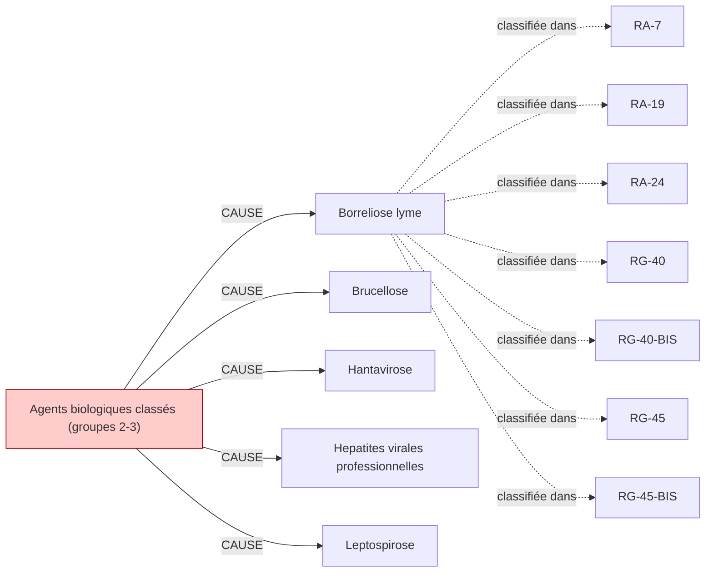

# Fiche pédagogique — **Agents biologiques classés (groupes 2-3)**

> Auto-générée depuis DEBBY KG (kuzu-49sub-v0.2)  
> Date : 2026-05-27  
> Usage : formation MdT / DES MST. **Ne remplace pas le jugement clinique.**  
> Sources primaires : INRS, HAS, Décrets FR. Cf. liens en bas de page.  

---

## 1. Identification chimique

- **Nom français** : Agents biologiques classés (groupes 2-3)
- **Nom anglais** : Biological agents class 2-3
- **Catégorie** : biologique

## 2. Pathologies professionnelles induites

| Pathologie | Type | Sévérité | Niveau de preuve |
|---|---|---|---|
| **Borreliose lyme** | autre | moderee | — |
| **Brucellose** | autre | moderee | — |
| **Hantavirose** | autre | moderee | — |
| **Hepatites virales professionnelles** | autre | moderee | — |
| **Leptospirose** | autre | moderee | — |
| **Tuberculose professionnelle** | autre | moderee | — |

## 3. Tableaux de maladies professionnelles applicables

| Tableau | Intitulé | Régime | Variante |
|---|---|---|---|
| **`RA-7`** | Tétanos professionnel agricole (suite RA-1) | RA | — |
| **`RA-19`** | Leptospirose professionnelle agricole | RA | — |
| **`RA-24`** | Brucelloses professionnelles agricoles (variante RA-6) | RA | — |
| **`RG-40`** | Maladies dues aux bacilles tuberculeux et à certaines mycobactéries atypiques (BK) | RG | — |
| **`RG-40-BIS`** | Infections d'origine professionnelle par les virus des hépatites | RG | BIS |
| **`RG-45`** | Infections d'origine professionnelle par les virus des hépatites A, B, C, D, E | RG | — |
| **`RG-45-BIS`** | Infections d'origine professionnelle par le virus de l'immunodéficience humaine (VIH) | RG | BIS |

> ℹ️ Pour chaque tableau, vérifier :
> - Délai de prise en charge
> - Durée d'exposition minimale
> - Liste limitative ou indicative des travaux
> via [INRS BDD MP](https://www.inrs.fr/publications/bdd/mp/listeTableaux.html) ou MCP SSTinfo `lookup_tableau_mp`.

## 4. Métiers et secteurs exposés

**AGRICULTURE** : Eleveur, Forestier

**INDUSTRIE** : Egoutier

**SANTE** : Soignant, Veterinaire

## 5. Organes/systèmes cibles

- **Foie** (système digestif)
- **Poumon** (système respiratoire)

## 6. Surveillance médicale recommandée

_Aucune surveillance recommandée renseignée dans le KG._

## 7. Vue graphique focalisée

> Pour la vue complète : `kg/exports/debby_kg_agents_biologiques_groupe2_3_v0.1.mermaid.md`

## 8. Sources et traçabilité

- **Source officielle substance** : https://www.inrs.fr/risques/biologiques
- **Tableaux MP** : [INRS bdd/mp/listeTableaux.html](https://www.inrs.fr/publications/bdd/mp/listeTableaux.html) (vérifié 2026-05-27, 175 tableaux dont 28 BIS/TER)
- **VLEP** : [INRS ED 984 — Valeurs limites](https://www.inrs.fr/publications/outils/aide-substances-cmr.html)
- **Recommandations HAS** : [has-sante.fr](https://www.has-sante.fr/)
- **MCP SSTinfo** : `lookup_substance`, `lookup_tableau_mp`, `lookup_metier` pour validation en ligne
- **Corpus DEBBY** : 2,6 M œuvres, 22,9 M chunks (cf. `DEBBY_AUDIT_SNAPSHOT.md`)

## 9. Versioning

- `kg_version` : `kuzu-49sub-v0.2`
- `corpus_version` : `2.1` (cf. `VERSIONS.md`)
- `fiche_generated_at` : `2026-05-27`
- `pipeline` : `kg/scripts/export_fiche_pedagogique.py --substance agents_biologiques_groupe2_3`

---

**Avertissement** : Cette fiche est un support pédagogique généré automatiquement depuis le KG DEBBY. Elle agrège des sources de référence (INRS, HAS, décrets FR) mais ne remplace pas la lecture des textes primaires ni le jugement clinique du médecin du travail. Toujours vérifier les recommandations en vigueur pour la prise de décision.