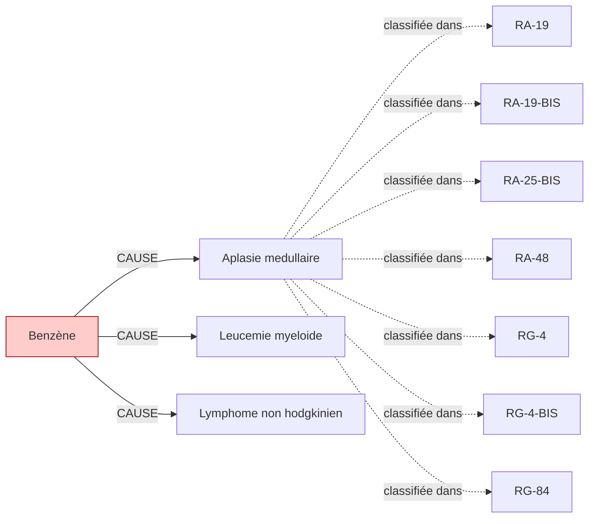

# Fiche pédagogique — **Benzène**

> Auto-générée depuis DEBBY KG (kuzu-49sub-v0.2)  
> Date : 2026-05-27  
> Usage : formation MdT / DES MST. **Ne remplace pas le jugement clinique.**  
> Sources primaires : INRS, HAS, Décrets FR. Cf. liens en bas de page.  

---

## 1. Identification chimique

- **Nom français** : Benzène
- **Nom anglais** : Benzene
- **N° CAS** : `71-43-2`
- **Catégorie** : cov
- **CMR (CLP)** : **M1B+C1A** ⚠️
- **VLEP 8h** : `1.65 mg/m³`

## 2. Pathologies professionnelles induites

| Pathologie | Type | Sévérité | Niveau de preuve |
|---|---|---|---|
| **Aplasie medullaire** | autre | moderee | IARC-1 |
| **Leucemie myeloide** | cancer | grave | IARC-1 |
| **Lymphome non hodgkinien** | cancer | grave | IARC-1 |

## 3. Tableaux de maladies professionnelles applicables

| Tableau | Intitulé | Régime | Variante |
|---|---|---|---|
| **`RA-19`** | Leptospirose professionnelle agricole | RA | — |
| **`RA-19-BIS`** | Leptospirose ictéro-hémorragique (variante) | RA | BIS |
| **`RA-25-BIS`** | Affections gastro-intestinales et hépatiques provoquées par le benzène en agriculture | RA | BIS |
| **`RA-48`** | Affections engendrées par les bétas-naphtylamine en agriculture | RA | — |
| **`RG-4`** | Hémopathies provoquées par le benzène et tous les produits en renfermant | RG | — |
| **`RG-4-BIS`** | Affections gastro-intestinales, hépatiques, rénales et neurologiques provoquées par le benzène, le toluène, les xylènes | RG | BIS |
| **`RG-84`** | Affections engendrées par les solvants organiques liquides à usage professionnel (toluène, xylène, MEK, etc.) | RG | — |

> ℹ️ Pour chaque tableau, vérifier :
> - Délai de prise en charge
> - Durée d'exposition minimale
> - Liste limitative ou indicative des travaux
> via [INRS BDD MP](https://www.inrs.fr/publications/bdd/mp/listeTableaux.html) ou MCP SSTinfo `lookup_tableau_mp`.

## 4. Métiers et secteurs exposés

**INDUSTRIE** : Chimiste, Imprimeur, Pompiste, Pressing, Raffineur

## 5. Organes/systèmes cibles

- **Moelle osseuse** (système hematopoietique)

## 6. Surveillance médicale recommandée

| Pathologie ciblée | Examen | Périodicité | Source | Année |
|---|---|---|---|---|
| Aplasie medullaire | **Numération formule sanguine + plaquettes** | 6 mois | `INRS-benzène` | 2020 |
| Lymphome non hodgkinien | **Numération formule sanguine + plaquettes** | 12 mois | `INRS-benzène` | 2020 |
| Leucemie myeloide | **Numération formule sanguine + plaquettes** | 6 mois | `INRS-benzène` | 2020 |

> ⚠️ **Toujours vérifier la dernière édition des recommandations** (HAS, INRS, décrets en vigueur).
> Cette fiche est versionnée KG=`kuzu-49sub-v0.2` — si > 6 mois, ré-exécuter le pipeline KG pour intégrer les mises à jour réglementaires.

## 7. Vue graphique focalisée

> Pour la vue complète : `kg/exports/debby_kg_benzene_v0.1.mermaid.md`

## 8. Sources et traçabilité

- **Source officielle substance** : https://www.inrs.fr/risques/benzene
- **Tableaux MP** : [INRS bdd/mp/listeTableaux.html](https://www.inrs.fr/publications/bdd/mp/listeTableaux.html) (vérifié 2026-05-27, 175 tableaux dont 28 BIS/TER)
- **VLEP** : [INRS ED 984 — Valeurs limites](https://www.inrs.fr/publications/outils/aide-substances-cmr.html)
- **Recommandations HAS** : [has-sante.fr](https://www.has-sante.fr/)
- **MCP SSTinfo** : `lookup_substance`, `lookup_tableau_mp`, `lookup_metier` pour validation en ligne
- **Corpus DEBBY** : 2,6 M œuvres, 22,9 M chunks (cf. `DEBBY_AUDIT_SNAPSHOT.md`)

## 9. Versioning

- `kg_version` : `kuzu-49sub-v0.2`
- `corpus_version` : `2.1` (cf. `VERSIONS.md`)
- `fiche_generated_at` : `2026-05-27`
- `pipeline` : `kg/scripts/export_fiche_pedagogique.py --substance benzene`

---

**Avertissement** : Cette fiche est un support pédagogique généré automatiquement depuis le KG DEBBY. Elle agrège des sources de référence (INRS, HAS, décrets FR) mais ne remplace pas la lecture des textes primaires ni le jugement clinique du médecin du travail. Toujours vérifier les recommandations en vigueur pour la prise de décision.