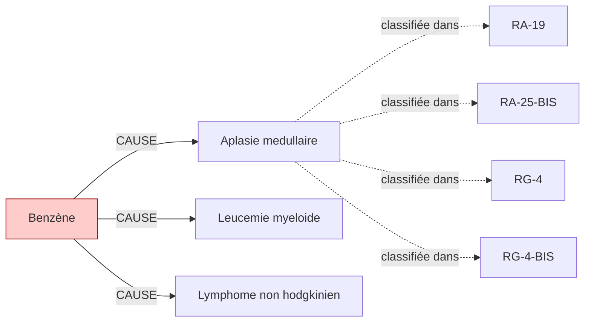

# Fiche pédagogique — **Benzène**

> Auto-générée depuis DEBBY KG (kuzu-10sub-v0.1)  
> Date : 2026-05-27  
> Usage : formation MdT / DES MST. **Ne remplace pas le jugement clinique.**  
> Sources primaires : INRS, HAS, Décrets FR. Cf. liens en bas de page.  

---

## 1. Identification chimique

- **Nom français** : Benzène
- **Nom anglais** : Benzene
- **N° CAS** : `71-43-2`
- **Catégorie** : cov
- **CMR (CLP)** : **Cancérogène avéré 1A** ⚠️
- **VLEP 8h** : `3.25 mg/m³`

## 2. Pathologies professionnelles induites

| Pathologie | Type | Sévérité | Niveau de preuve |
|---|---|---|---|
| **Aplasie medullaire** | autre | moderee | IARC-1 |
| **Leucemie myeloide** | cancer | grave | IARC-1 |
| **Lymphome non hodgkinien** | cancer | grave | IARC-1 |

## 3. Tableaux de maladies professionnelles applicables

| Tableau | Intitulé | Régime | Variante |
|---|---|---|---|
| **`RA-19`** | Tableau RA n°19 | RA | — |
| **`RA-25-BIS`** | Tableau RA n°25 BIS | RA | BIS |
| **`RG-4`** | Tableau RG n°4 | RG | — |
| **`RG-4-BIS`** | Tableau RG n°4 BIS | RG | BIS |

> ℹ️ Pour chaque tableau, vérifier :
> - Délai de prise en charge
> - Durée d'exposition minimale
> - Liste limitative ou indicative des travaux
> via [INRS BDD MP](https://www.inrs.fr/publications/bdd/mp/listeTableaux.html) ou MCP SSTinfo `lookup_tableau_mp`.

## 4. Métiers et secteurs exposés

**INDUSTRIE** : Chimiste, Imprimeur, Pompiste, Pressing, Raffineur

## 5. Organes/systèmes cibles

- **Moelle osseuse** (système hematopoietique)

## 6. Surveillance médicale recommandée

_Aucune surveillance recommandée renseignée dans le KG._

## 7. Vue graphique focalisée

> Pour la vue complète : `kg/exports/debby_kg_benzene_v0.1.mermaid.md`

## 8. Sources et traçabilité

- **Source officielle substance** : https://www.inrs.fr/risques/benzene
- **Tableaux MP** : [INRS bdd/mp/listeTableaux.html](https://www.inrs.fr/publications/bdd/mp/listeTableaux.html) (vérifié 2026-05-27, 175 tableaux dont 28 BIS/TER)
- **VLEP** : [INRS ED 984 — Valeurs limites](https://www.inrs.fr/publications/outils/aide-substances-cmr.html)
- **Recommandations HAS** : [has-sante.fr](https://www.has-sante.fr/)
- **MCP SSTinfo** : `lookup_substance`, `lookup_tableau_mp`, `lookup_metier` pour validation en ligne
- **Corpus DEBBY** : 2,6 M œuvres, 22,9 M chunks (cf. `DEBBY_AUDIT_SNAPSHOT.md`)

## 9. Versioning

- `kg_version` : `kuzu-10sub-v0.1`
- `corpus_version` : `2.1` (cf. `VERSIONS.md`)
- `fiche_generated_at` : `2026-05-27`
- `pipeline` : `kg/scripts/export_fiche_pedagogique.py --substance benzene`

---

**Avertissement** : Cette fiche est un support pédagogique généré automatiquement depuis le KG DEBBY. Elle agrège des sources de référence (INRS, HAS, décrets FR) mais ne remplace pas la lecture des textes primaires ni le jugement clinique du médecin du travail. Toujours vérifier les recommandations en vigueur pour la prise de décision.