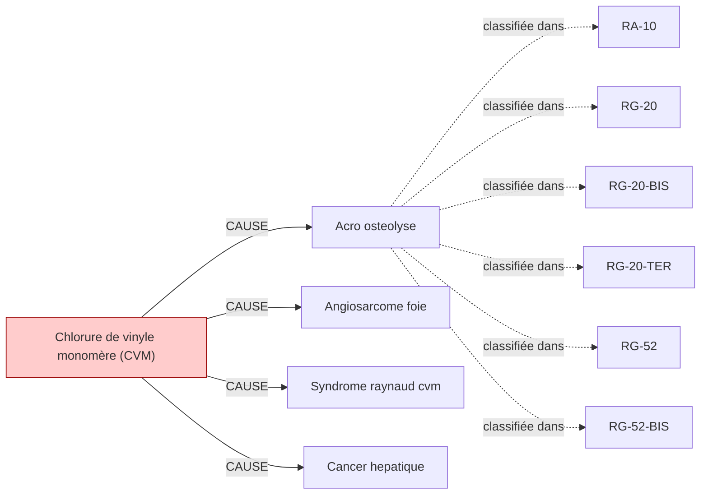

# Fiche pédagogique — **Chlorure de vinyle monomère (CVM)**

> Auto-générée depuis DEBBY KG (kuzu-49sub-v0.2)  
> Date : 2026-05-27  
> Usage : formation MdT / DES MST. **Ne remplace pas le jugement clinique.**  
> Sources primaires : INRS, HAS, Décrets FR. Cf. liens en bas de page.  

---

## 1. Identification chimique

- **Nom français** : Chlorure de vinyle monomère (CVM)
- **Nom anglais** : Vinyl chloride
- **N° CAS** : `75-01-4`
- **Catégorie** : cov
- **CMR (CLP)** : **Cancérogène avéré 1A** ⚠️
- **VLEP 8h** : `2.59 mg/m³`

## 2. Pathologies professionnelles induites

| Pathologie | Type | Sévérité | Niveau de preuve |
|---|---|---|---|
| **Acro osteolyse** | autre | moderee | IARC-1 |
| **Angiosarcome foie** | autre | moderee | IARC-1 |
| **Syndrome raynaud cvm** | autre | moderee | IARC-1 |
| **Cancer hepatique** | cancer | grave | IARC-1 |

## 3. Tableaux de maladies professionnelles applicables

| Tableau | Intitulé | Régime | Variante |
|---|---|---|---|
| **`RA-10`** | Affections provoquées par l'arsenic et ses composés agricoles | RA | — |
| **`RG-20`** | Affections provoquées par l'arsenic et ses composés | RG | — |
| **`RG-20-BIS`** | Cancers broncho-pulmonaires primitifs causés par l'inhalation de poussières renfermant des arséniates | RG | BIS |
| **`RG-20-TER`** | Cancer cutané provoqué par l'arsenic et ses composés minéraux | RG | TER |
| **`RG-52`** | Affections provoquées par le chlorure de vinyle monomère (CVM) | RG | — |
| **`RG-52-BIS`** | Hémangiosarcome du foie provoqué par le chlorure de vinyle monomère | RG | BIS |

> ℹ️ Pour chaque tableau, vérifier :
> - Délai de prise en charge
> - Durée d'exposition minimale
> - Liste limitative ou indicative des travaux
> via [INRS BDD MP](https://www.inrs.fr/publications/bdd/mp/listeTableaux.html) ou MCP SSTinfo `lookup_tableau_mp`.

## 4. Métiers et secteurs exposés

**INDUSTRIE** : Ouvrier petrochimie, Plasturgiste, Polymerisation pvc

## 5. Organes/systèmes cibles

- **Foie** (système digestif)
- **Os** (système musculo_squelettique)
- **Peau** (système tegumentaire)

## 6. Surveillance médicale recommandée

| Pathologie ciblée | Examen | Périodicité | Source | Année |
|---|---|---|---|---|
| Angiosarcome foie | **Scanner thoracique** | 24 mois | `INRS-2017` | 2017 |

> ⚠️ **Toujours vérifier la dernière édition des recommandations** (HAS, INRS, décrets en vigueur).
> Cette fiche est versionnée KG=`kuzu-49sub-v0.2` — si > 6 mois, ré-exécuter le pipeline KG pour intégrer les mises à jour réglementaires.

## 7. Vue graphique focalisée

> Pour la vue complète : `kg/exports/debby_kg_chlorure_vinyle_v0.1.mermaid.md`

## 8. Sources et traçabilité

- **Source officielle substance** : https://www.inrs.fr/risques/chlorure-vinyle
- **Tableaux MP** : [INRS bdd/mp/listeTableaux.html](https://www.inrs.fr/publications/bdd/mp/listeTableaux.html) (vérifié 2026-05-27, 175 tableaux dont 28 BIS/TER)
- **VLEP** : [INRS ED 984 — Valeurs limites](https://www.inrs.fr/publications/outils/aide-substances-cmr.html)
- **Recommandations HAS** : [has-sante.fr](https://www.has-sante.fr/)
- **MCP SSTinfo** : `lookup_substance`, `lookup_tableau_mp`, `lookup_metier` pour validation en ligne
- **Corpus DEBBY** : 2,6 M œuvres, 22,9 M chunks (cf. `DEBBY_AUDIT_SNAPSHOT.md`)

## 9. Versioning

- `kg_version` : `kuzu-49sub-v0.2`
- `corpus_version` : `2.1` (cf. `VERSIONS.md`)
- `fiche_generated_at` : `2026-05-27`
- `pipeline` : `kg/scripts/export_fiche_pedagogique.py --substance chlorure_vinyle`

---

**Avertissement** : Cette fiche est un support pédagogique généré automatiquement depuis le KG DEBBY. Elle agrège des sources de référence (INRS, HAS, décrets FR) mais ne remplace pas la lecture des textes primaires ni le jugement clinique du médecin du travail. Toujours vérifier les recommandations en vigueur pour la prise de décision.