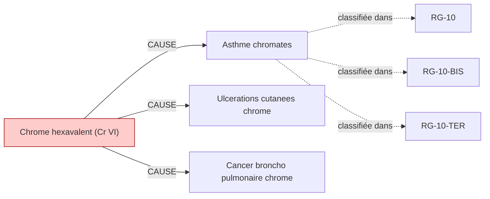

# Fiche pédagogique — **Chrome hexavalent (Cr VI)**

> Auto-générée depuis DEBBY KG (kuzu-49sub-v0.2)  
> Date : 2026-05-27  
> Usage : formation MdT / DES MST. **Ne remplace pas le jugement clinique.**  
> Sources primaires : INRS, HAS, Décrets FR. Cf. liens en bas de page.  

---

## 1. Identification chimique

- **Nom français** : Chrome hexavalent (Cr VI)
- **Nom anglais** : Hexavalent chromium
- **N° CAS** : `18540-29-9`
- **Catégorie** : metal
- **CMR (CLP)** : **Cancérogène avéré 1A** ⚠️
- **VLEP 8h** : `0.001 mg/m³`
- **VLEP court terme** : `0.005 mg/m³`

## 2. Pathologies professionnelles induites

| Pathologie | Type | Sévérité | Niveau de preuve |
|---|---|---|---|
| **Asthme chromates** | respiratoire | moderee | IARC-1 |
| **Ulcerations cutanees chrome** | cutanee | legere | IARC-1 |
| **Cancer broncho pulmonaire chrome** | cancer | grave | IARC-1 |

## 3. Tableaux de maladies professionnelles applicables

| Tableau | Intitulé | Régime | Variante |
|---|---|---|---|
| **`RG-10`** | Ulcérations et dermites provoquées par l'acide chromique, les chromates et bichromates alcalins | RG | — |
| **`RG-10-BIS`** | Affections respiratoires (asthme, rhinite) causées par l'acide chromique, les chromates et bichromates alcalins, le ciment | RG | BIS |
| **`RG-10-TER`** | Cancer broncho-pulmonaire primitif causé par l'inhalation de poussières ou vapeurs renfermant du chrome | RG | TER |

> ℹ️ Pour chaque tableau, vérifier :
> - Délai de prise en charge
> - Durée d'exposition minimale
> - Liste limitative ou indicative des travaux
> via [INRS BDD MP](https://www.inrs.fr/publications/bdd/mp/listeTableaux.html) ou MCP SSTinfo `lookup_tableau_mp`.

## 4. Métiers et secteurs exposés

**INDUSTRIE** : Chromage electrolytique, Peintre, Soudeur inox, Tanneur

## 5. Organes/systèmes cibles

- **Peau** (système tegumentaire)
- **Poumon** (système respiratoire)

## 6. Surveillance médicale recommandée

| Pathologie ciblée | Examen | Périodicité | Source | Année |
|---|---|---|---|---|
| Cancer broncho pulmonaire chrome | **Scanner thoracique** | 60 mois | `HAS-2022` | 2022 |
| Ulcerations cutanees chrome | **Dosage chrome urinaire** | 12 mois | `INRS-2020` | 2020 |
| Asthme chromates | **Épreuves fonctionnelles respiratoires (EFR)** | 12 mois | `INRS-2017` | 2017 |

> ⚠️ **Toujours vérifier la dernière édition des recommandations** (HAS, INRS, décrets en vigueur).
> Cette fiche est versionnée KG=`kuzu-49sub-v0.2` — si > 6 mois, ré-exécuter le pipeline KG pour intégrer les mises à jour réglementaires.

## 7. Vue graphique focalisée

> Pour la vue complète : `kg/exports/debby_kg_chrome_hexavalent_v0.1.mermaid.md`

## 8. Sources et traçabilité

- **Source officielle substance** : https://www.inrs.fr/risques/chrome
- **Tableaux MP** : [INRS bdd/mp/listeTableaux.html](https://www.inrs.fr/publications/bdd/mp/listeTableaux.html) (vérifié 2026-05-27, 175 tableaux dont 28 BIS/TER)
- **VLEP** : [INRS ED 984 — Valeurs limites](https://www.inrs.fr/publications/outils/aide-substances-cmr.html)
- **Recommandations HAS** : [has-sante.fr](https://www.has-sante.fr/)
- **MCP SSTinfo** : `lookup_substance`, `lookup_tableau_mp`, `lookup_metier` pour validation en ligne
- **Corpus DEBBY** : 2,6 M œuvres, 22,9 M chunks (cf. `DEBBY_AUDIT_SNAPSHOT.md`)

## 9. Versioning

- `kg_version` : `kuzu-49sub-v0.2`
- `corpus_version` : `2.1` (cf. `VERSIONS.md`)
- `fiche_generated_at` : `2026-05-27`
- `pipeline` : `kg/scripts/export_fiche_pedagogique.py --substance chrome_hexavalent`

---

**Avertissement** : Cette fiche est un support pédagogique généré automatiquement depuis le KG DEBBY. Elle agrège des sources de référence (INRS, HAS, décrets FR) mais ne remplace pas la lecture des textes primaires ni le jugement clinique du médecin du travail. Toujours vérifier les recommandations en vigueur pour la prise de décision.