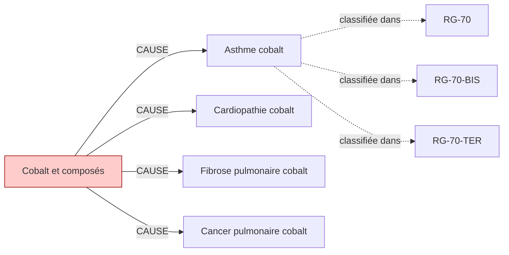

# Fiche pédagogique — **Cobalt et composés**

> Auto-générée depuis DEBBY KG (kuzu-49sub-v0.2)  
> Date : 2026-05-27  
> Usage : formation MdT / DES MST. **Ne remplace pas le jugement clinique.**  
> Sources primaires : INRS, HAS, Décrets FR. Cf. liens en bas de page.  

---

## 1. Identification chimique

- **Nom français** : Cobalt et composés
- **Nom anglais** : Cobalt
- **N° CAS** : `7440-48-4`
- **Catégorie** : metal
- **CMR (CLP)** : **Cancérogène présumé 1B** ⚠️
- **VLEP 8h** : `0.01 mg/m³`

## 2. Pathologies professionnelles induites

| Pathologie | Type | Sévérité | Niveau de preuve |
|---|---|---|---|
| **Asthme cobalt** | respiratoire | moderee | IARC-2B |
| **Cardiopathie cobalt** | autre | moderee | IARC-2B |
| **Fibrose pulmonaire cobalt** | autre | moderee | IARC-2B |
| **Cancer pulmonaire cobalt** | cancer | grave | IARC-2B |

## 3. Tableaux de maladies professionnelles applicables

| Tableau | Intitulé | Régime | Variante |
|---|---|---|---|
| **`RG-70`** | Affections professionnelles provoquées par le cobalt | RG | — |
| **`RG-70-BIS`** | Affections respiratoires causées par l'inhalation de poussières de cobalt | RG | BIS |
| **`RG-70-TER`** | Cancer broncho-pulmonaire dû à l'inhalation de poussières renfermant du cobalt associé au carbure de tungstène | RG | TER |

> ℹ️ Pour chaque tableau, vérifier :
> - Délai de prise en charge
> - Durée d'exposition minimale
> - Liste limitative ou indicative des travaux
> via [INRS BDD MP](https://www.inrs.fr/publications/bdd/mp/listeTableaux.html) ou MCP SSTinfo `lookup_tableau_mp`.

## 4. Métiers et secteurs exposés

**INDUSTRIE** : Affutage metaux dur, Aiguiseur, Verrerie

**SANTE** : Prothesiste dentaire

## 5. Organes/systèmes cibles

- **Poumon** (système respiratoire)

## 6. Surveillance médicale recommandée

| Pathologie ciblée | Examen | Périodicité | Source | Année |
|---|---|---|---|---|
| Cancer pulmonaire cobalt | **Scanner thoracique** | 60 mois | `HAS-2022` | 2022 |
| Fibrose pulmonaire cobalt | **Épreuves fonctionnelles respiratoires (EFR)** | 12 mois | `INRS-2018` | 2018 |
| Asthme cobalt | **Épreuves fonctionnelles respiratoires (EFR)** | 12 mois | `INRS-2017` | 2017 |

> ⚠️ **Toujours vérifier la dernière édition des recommandations** (HAS, INRS, décrets en vigueur).
> Cette fiche est versionnée KG=`kuzu-49sub-v0.2` — si > 6 mois, ré-exécuter le pipeline KG pour intégrer les mises à jour réglementaires.

## 7. Vue graphique focalisée

> Pour la vue complète : `kg/exports/debby_kg_cobalt_v0.1.mermaid.md`

## 8. Sources et traçabilité

- **Source officielle substance** : https://www.inrs.fr/risques/cobalt
- **Tableaux MP** : [INRS bdd/mp/listeTableaux.html](https://www.inrs.fr/publications/bdd/mp/listeTableaux.html) (vérifié 2026-05-27, 175 tableaux dont 28 BIS/TER)
- **VLEP** : [INRS ED 984 — Valeurs limites](https://www.inrs.fr/publications/outils/aide-substances-cmr.html)
- **Recommandations HAS** : [has-sante.fr](https://www.has-sante.fr/)
- **MCP SSTinfo** : `lookup_substance`, `lookup_tableau_mp`, `lookup_metier` pour validation en ligne
- **Corpus DEBBY** : 2,6 M œuvres, 22,9 M chunks (cf. `DEBBY_AUDIT_SNAPSHOT.md`)

## 9. Versioning

- `kg_version` : `kuzu-49sub-v0.2`
- `corpus_version` : `2.1` (cf. `VERSIONS.md`)
- `fiche_generated_at` : `2026-05-27`
- `pipeline` : `kg/scripts/export_fiche_pedagogique.py --substance cobalt`

---

**Avertissement** : Cette fiche est un support pédagogique généré automatiquement depuis le KG DEBBY. Elle agrège des sources de référence (INRS, HAS, décrets FR) mais ne remplace pas la lecture des textes primaires ni le jugement clinique du médecin du travail. Toujours vérifier les recommandations en vigueur pour la prise de décision.