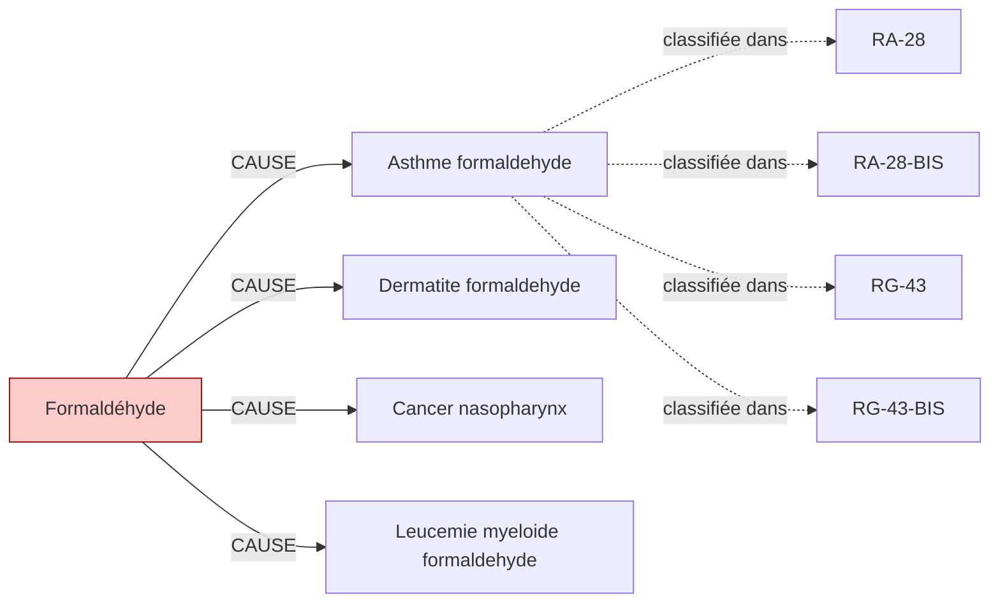

# Fiche pédagogique — **Formaldéhyde**

> Auto-générée depuis DEBBY KG (kuzu-49sub-v0.2)  
> Date : 2026-05-27  
> Usage : formation MdT / DES MST. **Ne remplace pas le jugement clinique.**  
> Sources primaires : INRS, HAS, Décrets FR. Cf. liens en bas de page.  

---

## 1. Identification chimique

- **Nom français** : Formaldéhyde
- **Nom anglais** : Formaldehyde
- **N° CAS** : `50-00-0`
- **Catégorie** : cov
- **CMR (CLP)** : **M2+C1B** ⚠️
- **VLEP 8h** : `0.37 mg/m³`
- **VLEP court terme** : `0.74 mg/m³`

## 2. Pathologies professionnelles induites

| Pathologie | Type | Sévérité | Niveau de preuve |
|---|---|---|---|
| **Asthme formaldehyde** | respiratoire | moderee | IARC-1 |
| **Dermatite formaldehyde** | cutanee | legere | IARC-1 |
| **Cancer nasopharynx** | cancer | grave | IARC-1 |
| **Leucemie myeloide formaldehyde** | cancer | grave | IARC-1 |

## 3. Tableaux de maladies professionnelles applicables

| Tableau | Intitulé | Régime | Variante |
|---|---|---|---|
| **`RA-28`** | Affections respiratoires causées par les moisissures et bactéries thermophiles | RA | — |
| **`RA-28-BIS`** | Affections respiratoires aux fientes d'oiseaux | RA | BIS |
| **`RG-43`** | Affections engendrées par les aldéhydes (aldéhyde formique - formaldéhyde, etc.) | RG | — |
| **`RG-43-BIS`** | Affections cancéreuses provoquées par l'aldéhyde formique (cancer naso-sinusien) | RG | BIS |

> ℹ️ Pour chaque tableau, vérifier :
> - Délai de prise en charge
> - Durée d'exposition minimale
> - Liste limitative ou indicative des travaux
> via [INRS BDD MP](https://www.inrs.fr/publications/bdd/mp/listeTableaux.html) ou MCP SSTinfo `lookup_tableau_mp`.

## 4. Métiers et secteurs exposés

**INDUSTRIE** : Menuisier panneaux

**SANTE** : Personnel anatomopathologie, Personnel morgue

## 5. Organes/systèmes cibles

- **Peau** (système tegumentaire)
- **Poumon** (système respiratoire)
- **Voies aériennes supérieures** (système respiratoire)

## 6. Surveillance médicale recommandée

| Pathologie ciblée | Examen | Périodicité | Source | Année |
|---|---|---|---|---|
| Asthme formaldehyde | **Épreuves fonctionnelles respiratoires (EFR)** | 12 mois | `INRS-2017` | 2017 |

> ⚠️ **Toujours vérifier la dernière édition des recommandations** (HAS, INRS, décrets en vigueur).
> Cette fiche est versionnée KG=`kuzu-49sub-v0.2` — si > 6 mois, ré-exécuter le pipeline KG pour intégrer les mises à jour réglementaires.

## 7. Vue graphique focalisée

> Pour la vue complète : `kg/exports/debby_kg_formaldehyde_v0.1.mermaid.md`

## 8. Sources et traçabilité

- **Source officielle substance** : https://www.inrs.fr/risques/formaldehyde
- **Tableaux MP** : [INRS bdd/mp/listeTableaux.html](https://www.inrs.fr/publications/bdd/mp/listeTableaux.html) (vérifié 2026-05-27, 175 tableaux dont 28 BIS/TER)
- **VLEP** : [INRS ED 984 — Valeurs limites](https://www.inrs.fr/publications/outils/aide-substances-cmr.html)
- **Recommandations HAS** : [has-sante.fr](https://www.has-sante.fr/)
- **MCP SSTinfo** : `lookup_substance`, `lookup_tableau_mp`, `lookup_metier` pour validation en ligne
- **Corpus DEBBY** : 2,6 M œuvres, 22,9 M chunks (cf. `DEBBY_AUDIT_SNAPSHOT.md`)

## 9. Versioning

- `kg_version` : `kuzu-49sub-v0.2`
- `corpus_version` : `2.1` (cf. `VERSIONS.md`)
- `fiche_generated_at` : `2026-05-27`
- `pipeline` : `kg/scripts/export_fiche_pedagogique.py --substance formaldehyde`

---

**Avertissement** : Cette fiche est un support pédagogique généré automatiquement depuis le KG DEBBY. Elle agrège des sources de référence (INRS, HAS, décrets FR) mais ne remplace pas la lecture des textes primaires ni le jugement clinique du médecin du travail. Toujours vérifier les recommandations en vigueur pour la prise de décision.