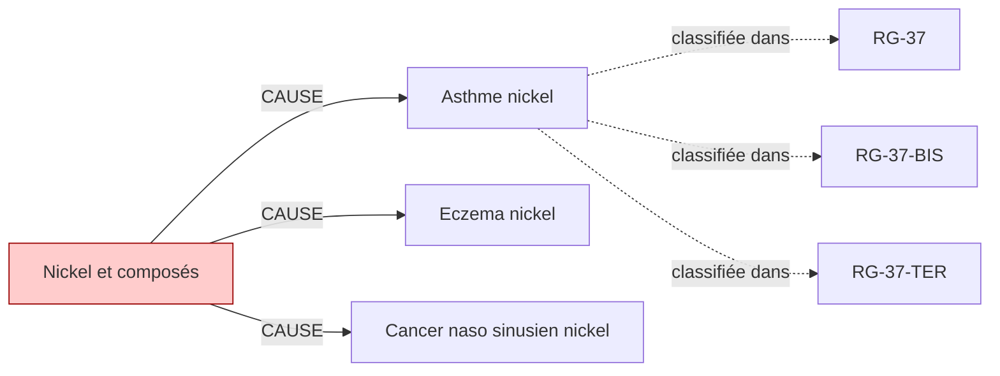

# Fiche pédagogique — **Nickel et composés**

> Auto-générée depuis DEBBY KG (kuzu-49sub-v0.2)  
> Date : 2026-05-27  
> Usage : formation MdT / DES MST. **Ne remplace pas le jugement clinique.**  
> Sources primaires : INRS, HAS, Décrets FR. Cf. liens en bas de page.  

---

## 1. Identification chimique

- **Nom français** : Nickel et composés
- **Nom anglais** : Nickel and compounds
- **N° CAS** : `7440-02-0`
- **Catégorie** : metal
- **CMR (CLP)** : **Cancérogène suspecté** ⚠️
- **VLEP 8h** : `0.01 mg/m³`

## 2. Pathologies professionnelles induites

| Pathologie | Type | Sévérité | Niveau de preuve |
|---|---|---|---|
| **Asthme nickel** | respiratoire | moderee | IARC-1 |
| **Eczema nickel** | cutanee | legere | IARC-1 |
| **Cancer naso sinusien nickel** | cancer | grave | IARC-1 |

## 3. Tableaux de maladies professionnelles applicables

| Tableau | Intitulé | Régime | Variante |
|---|---|---|---|
| **`RG-37`** | Affections cutanées et muqueuses provoquées par les composés du nickel | RG | — |
| **`RG-37-BIS`** | Affections respiratoires (asthme, rhinite) causées par les composés du nickel | RG | BIS |
| **`RG-37-TER`** | Cancer primitif de l'ethmoïde et des sinus de la face causé par les opérations de grillage des mattes de nickel | RG | TER |

> ℹ️ Pour chaque tableau, vérifier :
> - Délai de prise en charge
> - Durée d'exposition minimale
> - Liste limitative ou indicative des travaux
> via [INRS BDD MP](https://www.inrs.fr/publications/bdd/mp/listeTableaux.html) ou MCP SSTinfo `lookup_tableau_mp`.

## 4. Métiers et secteurs exposés

**INDUSTRIE** : Bijoutier, Galvaniseur, Raffinerie nickel, Soudeur inox

## 5. Organes/systèmes cibles

- **Peau** (système tegumentaire)
- **Poumon** (système respiratoire)
- **Voies aériennes supérieures** (système respiratoire)

## 6. Surveillance médicale recommandée

| Pathologie ciblée | Examen | Périodicité | Source | Année |
|---|---|---|---|---|
| Cancer naso sinusien nickel | **Scanner thoracique** | 60 mois | `HAS-2022` | 2022 |
| Cancer naso sinusien nickel | **Examen ORL (rhinoscopie, nasofibroscopie)** | 12 mois | `INRS-2020` | 2020 |
| Asthme nickel | **Épreuves fonctionnelles respiratoires (EFR)** | 12 mois | `INRS-2017` | 2017 |

> ⚠️ **Toujours vérifier la dernière édition des recommandations** (HAS, INRS, décrets en vigueur).
> Cette fiche est versionnée KG=`kuzu-49sub-v0.2` — si > 6 mois, ré-exécuter le pipeline KG pour intégrer les mises à jour réglementaires.

## 7. Vue graphique focalisée

> Pour la vue complète : `kg/exports/debby_kg_nickel_v0.1.mermaid.md`

## 8. Sources et traçabilité

- **Source officielle substance** : https://www.inrs.fr/risques/nickel
- **Tableaux MP** : [INRS bdd/mp/listeTableaux.html](https://www.inrs.fr/publications/bdd/mp/listeTableaux.html) (vérifié 2026-05-27, 175 tableaux dont 28 BIS/TER)
- **VLEP** : [INRS ED 984 — Valeurs limites](https://www.inrs.fr/publications/outils/aide-substances-cmr.html)
- **Recommandations HAS** : [has-sante.fr](https://www.has-sante.fr/)
- **MCP SSTinfo** : `lookup_substance`, `lookup_tableau_mp`, `lookup_metier` pour validation en ligne
- **Corpus DEBBY** : 2,6 M œuvres, 22,9 M chunks (cf. `DEBBY_AUDIT_SNAPSHOT.md`)

## 9. Versioning

- `kg_version` : `kuzu-49sub-v0.2`
- `corpus_version` : `2.1` (cf. `VERSIONS.md`)
- `fiche_generated_at` : `2026-05-27`
- `pipeline` : `kg/scripts/export_fiche_pedagogique.py --substance nickel`

---

**Avertissement** : Cette fiche est un support pédagogique généré automatiquement depuis le KG DEBBY. Elle agrège des sources de référence (INRS, HAS, décrets FR) mais ne remplace pas la lecture des textes primaires ni le jugement clinique du médecin du travail. Toujours vérifier les recommandations en vigueur pour la prise de décision.