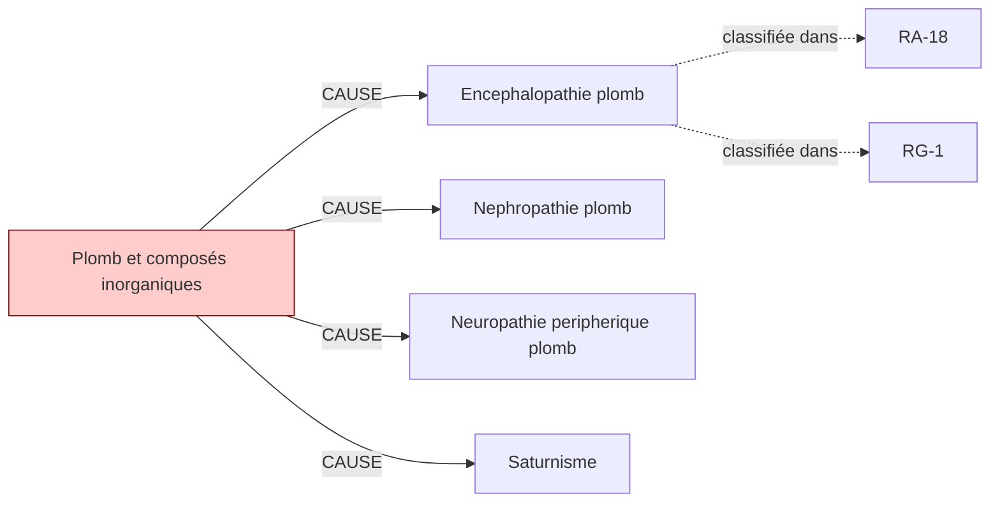

# Fiche pédagogique — **Plomb et composés inorganiques**

> Auto-générée depuis DEBBY KG (kuzu-10sub-v0.1)  
> Date : 2026-05-27  
> Usage : formation MdT / DES MST. **Ne remplace pas le jugement clinique.**  
> Sources primaires : INRS, HAS, Décrets FR. Cf. liens en bas de page.  

---

## 1. Identification chimique

- **Nom français** : Plomb et composés inorganiques
- **Nom anglais** : Lead and inorganic compounds
- **N° CAS** : `7439-92-1`
- **Catégorie** : metal
- **CMR (CLP)** : **Reprotoxique 1A** ⚠️
- **VLEP 8h** : `0.05 mg/m³`

## 2. Pathologies professionnelles induites

| Pathologie | Type | Sévérité | Niveau de preuve |
|---|---|---|---|
| **Encephalopathie plomb** | neurologique | moderee | IARC-2A |
| **Nephropathie plomb** | autre | moderee | IARC-2A |
| **Neuropathie peripherique plomb** | neurologique | moderee | IARC-2A |
| **Saturnisme** | autre | moderee | IARC-2A |

## 3. Tableaux de maladies professionnelles applicables

| Tableau | Intitulé | Régime | Variante |
|---|---|---|---|
| **`RA-18`** | Tableau RA n°18 | RA | — |
| **`RG-1`** | Tableau RG n°1 | RG | — |

> ℹ️ Pour chaque tableau, vérifier :
> - Délai de prise en charge
> - Durée d'exposition minimale
> - Liste limitative ou indicative des travaux
> via [INRS BDD MP](https://www.inrs.fr/publications/bdd/mp/listeTableaux.html) ou MCP SSTinfo `lookup_tableau_mp`.

## 4. Métiers et secteurs exposés

**INDUSTRIE** : Demolisseur, Ferrailleur, Fondeur, Ouvrier batteries, Peintre renovation

## 5. Organes/systèmes cibles

- **Rein** (système urinaire)
- **Système nerveux** (système neurologique)

## 6. Surveillance médicale recommandée

| Pathologie ciblée | Examen | Périodicité | Source | Année |
|---|---|---|---|---|
| Saturnisme | **Plombémie sanguine** | 6 mois | `Décret-3-mai-2023` | 2023 |
| Nephropathie plomb | **Créatininémie** | 12 mois | `Décret-3-mai-2023` | 2023 |
| Neuropathie peripherique plomb | **Plombémie sanguine** | 6 mois | `Décret-3-mai-2023` | 2023 |

> ⚠️ **Toujours vérifier la dernière édition des recommandations** (HAS, INRS, décrets en vigueur).
> Cette fiche est versionnée KG=`kuzu-10sub-v0.1` — si > 6 mois, ré-exécuter le pipeline KG pour intégrer les mises à jour réglementaires.

## 7. Vue graphique focalisée

> Pour la vue complète : `kg/exports/debby_kg_plomb_v0.1.mermaid.md`

## 8. Sources et traçabilité

- **Source officielle substance** : https://www.inrs.fr/risques/plomb
- **Tableaux MP** : [INRS bdd/mp/listeTableaux.html](https://www.inrs.fr/publications/bdd/mp/listeTableaux.html) (vérifié 2026-05-27, 175 tableaux dont 28 BIS/TER)
- **VLEP** : [INRS ED 984 — Valeurs limites](https://www.inrs.fr/publications/outils/aide-substances-cmr.html)
- **Recommandations HAS** : [has-sante.fr](https://www.has-sante.fr/)
- **MCP SSTinfo** : `lookup_substance`, `lookup_tableau_mp`, `lookup_metier` pour validation en ligne
- **Corpus DEBBY** : 2,6 M œuvres, 22,9 M chunks (cf. `DEBBY_AUDIT_SNAPSHOT.md`)

## 9. Versioning

- `kg_version` : `kuzu-10sub-v0.1`
- `corpus_version` : `2.1` (cf. `VERSIONS.md`)
- `fiche_generated_at` : `2026-05-27`
- `pipeline` : `kg/scripts/export_fiche_pedagogique.py --substance plomb`

---

**Avertissement** : Cette fiche est un support pédagogique généré automatiquement depuis le KG DEBBY. Elle agrège des sources de référence (INRS, HAS, décrets FR) mais ne remplace pas la lecture des textes primaires ni le jugement clinique du médecin du travail. Toujours vérifier les recommandations en vigueur pour la prise de décision.