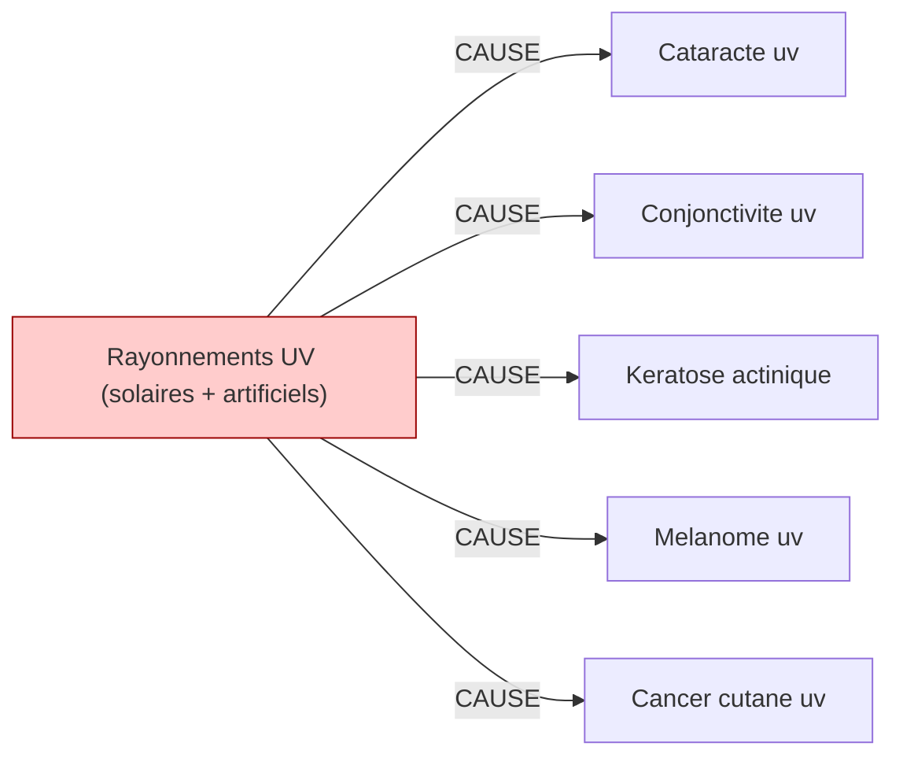

# Fiche pédagogique — **Rayonnements UV (solaires + artificiels)**

> Auto-générée depuis DEBBY KG (kuzu-49sub-v0.2)  
> Date : 2026-05-27  
> Usage : formation MdT / DES MST. **Ne remplace pas le jugement clinique.**  
> Sources primaires : INRS, HAS, Décrets FR. Cf. liens en bas de page.  

---

## 1. Identification chimique

- **Nom français** : Rayonnements UV (solaires + artificiels)
- **Nom anglais** : UV radiation
- **Catégorie** : physique
- **CMR (CLP)** : **Cancérogène avéré 1A** ⚠️

## 2. Pathologies professionnelles induites

| Pathologie | Type | Sévérité | Niveau de preuve |
|---|---|---|---|
| **Cataracte uv** | autre | moderee | IARC-1 |
| **Conjonctivite uv** | autre | moderee | IARC-1 |
| **Keratose actinique** | autre | moderee | IARC-1 |
| **Melanome uv** | autre | moderee | IARC-1 |
| **Cancer cutane uv** | cancer | grave | IARC-1 |

## 3. Tableaux de maladies professionnelles applicables

_Aucun tableau MP rattaché dans le KG._

> ℹ️ Pour chaque tableau, vérifier :
> - Délai de prise en charge
> - Durée d'exposition minimale
> - Liste limitative ou indicative des travaux
> via [INRS BDD MP](https://www.inrs.fr/publications/bdd/mp/listeTableaux.html) ou MCP SSTinfo `lookup_tableau_mp`.

## 4. Métiers et secteurs exposés

**BTP** : Btp outdoor

**AGRICULTURE** : Agriculteur

**INDUSTRIE** : Cabines uv, Marin, Soudeur

## 5. Organes/systèmes cibles

- **Peau** (système tegumentaire)

## 6. Surveillance médicale recommandée

_Aucune surveillance recommandée renseignée dans le KG._

## 7. Vue graphique focalisée

> Pour la vue complète : `kg/exports/debby_kg_uv_naturels_artificiels_v0.1.mermaid.md`

## 8. Sources et traçabilité

- **Source officielle substance** : https://www.inrs.fr/risques/uv
- **Tableaux MP** : [INRS bdd/mp/listeTableaux.html](https://www.inrs.fr/publications/bdd/mp/listeTableaux.html) (vérifié 2026-05-27, 175 tableaux dont 28 BIS/TER)
- **VLEP** : [INRS ED 984 — Valeurs limites](https://www.inrs.fr/publications/outils/aide-substances-cmr.html)
- **Recommandations HAS** : [has-sante.fr](https://www.has-sante.fr/)
- **MCP SSTinfo** : `lookup_substance`, `lookup_tableau_mp`, `lookup_metier` pour validation en ligne
- **Corpus DEBBY** : 2,6 M œuvres, 22,9 M chunks (cf. `DEBBY_AUDIT_SNAPSHOT.md`)

## 9. Versioning

- `kg_version` : `kuzu-49sub-v0.2`
- `corpus_version` : `2.1` (cf. `VERSIONS.md`)
- `fiche_generated_at` : `2026-05-27`
- `pipeline` : `kg/scripts/export_fiche_pedagogique.py --substance uv_naturels_artificiels`

---

**Avertissement** : Cette fiche est un support pédagogique généré automatiquement depuis le KG DEBBY. Elle agrège des sources de référence (INRS, HAS, décrets FR) mais ne remplace pas la lecture des textes primaires ni le jugement clinique du médecin du travail. Toujours vérifier les recommandations en vigueur pour la prise de décision.